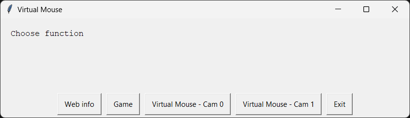

[](https://github.com/TienNHM/VirtualMouse/graphs/contributors)
[](https://github.com/TienNHM/VirtualMouse/issues)


[](https://github.com/TienNHM/VirtualMouse/graphs/code-frequency)

[](https://github.com/TienNHM/VirtualMouse/releases)

# VirtualMouse

## Install
```bash
pip install easygui webbrowser pyautogui cvzone opencv-python
```

## Publish

### 1. Run the following command to generate the executable file and spec file

```bash
pyinstaller --noconfirm --onefile --windowed --icon "dtn.ico" --name "VirtualMouse" --log-level "DEBUG"  "main.py"
```

### 2. Open the spec file and add the following code

* Notice: Add the code after the `block_cipher = None` line

```python
def get_mediapipe_path():
    import mediapipe
    mediapipe_path = mediapipe.__path__[0]
    return mediapipe_path
```

Then add the following code after the `pyz = PYZ(a.pure, a.zipped_data, cipher=block_cipher)` function

```python
mediapipe_tree = Tree(get_mediapipe_path(), prefix='mediapipe', excludes=["*.pyc"])
a.datas += mediapipe_tree
a.binaries = filter(lambda x: 'mediapipe' not in x[0], a.binaries)
```

### 3. Run the following command to generate the executable file

```bash
pyinstaller "VirtualMouse.spec"
```

## References
- https://python.tutorialink.com/issues-compiling-mediapipe-with-pyinstaller-on-macos/
- https://stackoverflow.com/a/67986441/10051568
